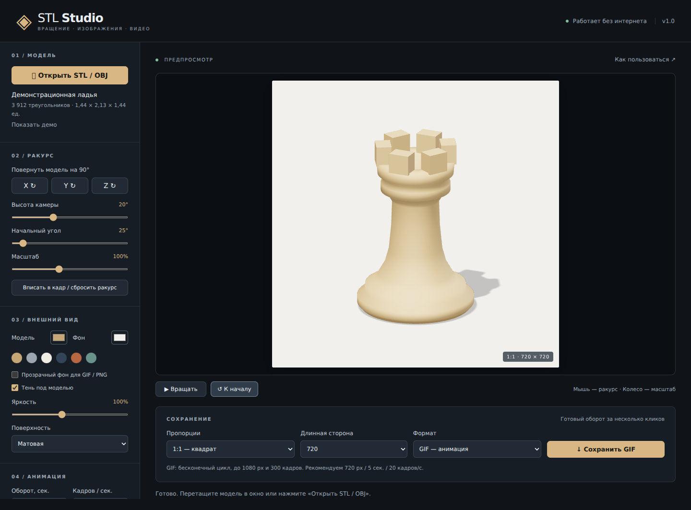

# STL Studio Offline

Приложение для создания вращающихся GIF и видео из STL/OBJ-моделей. Работает полностью локально, без сервера и регистрации. Интерфейс на русском языке.

**[Скачать готовое приложение для Windows — v1.0](releases/STL_Studio_Offline_v1.0.zip?raw=1)**



## Запуск

1. Скачайте ZIP и распакуйте его целиком в обычную папку.
2. Откройте `START.bat`. Приложение откроется отдельным окном в установленном Microsoft Edge или Google Chrome.
3. Откройте модель, настройте ракурс и нажмите «Сохранить».

Если BAT не запускается, откройте `STL_Studio_Offline.html` через Edge или Chrome. Интернет не нужен даже для первого запуска. Python, Node.js и FFmpeg для использования готового приложения не требуются.

## Возможности

- Импорт бинарного и текстового STL, а также OBJ.
- Вращение модели, выбор начального угла, направления, длительности и частоты кадров.
- Повороты модели по X / Y / Z на 90°, управление камерой мышью, масштаб и вписывание в кадр.
- Цвет модели, матовая/сатиновая/металлическая поверхность, яркость, фон и тень.
- Пропорции 1:1, 16:9, 9:16 и 3:4.
- Покадровый экспорт GIF, MP4 (H.264), WebM (VP9/VP8), а также PNG текущего вида.
- Прозрачный фон для GIF/PNG и отмена экспорта.
- Демонстрационная шахматная ладья для проверки без собственного STL.

Для начала рекомендуем **720 px, 5 секунд, 20 кадров/с, GIF**. Для качественного видео — **1080 px, 5 секунд, 30 кадров/с, MP4**.

## Ограничения

| Параметр | Значение |
|---|---|
| Размер входного файла | До 200 МБ; фактическая скорость зависит от модели и компьютера |
| Длинная сторона | 480, 720, 1080, 1440 или 1920 px |
| GIF | До 1080 px, 300 кадров, 256 цветов, прозрачность без полутонов |
| MP4 | Требует доступного H.264-кодировщика браузера; запасной формат — WebM |
| OBJ | Одноцветная геометрия, без MTL, внешних текстур и анимаций |
| Состояние | Модель и настройки не сохраняются после закрытия окна |

PNG сохраняет текущий кадр. GIF и видео начинают один полный оборот с выбранного начального угла. Видео сохраняется без звука и использует цвет фона вместо прозрачности. При масштабе больше 100% модель может выходить за границы кадра.

Геометрия не упрощается и не дорисовывается. Приложение отображает поверхность 3D-модели, без имитации слоёв FDM-печати. STL/OBJ часто не содержат единиц измерения, поэтому размеры показаны в единицах файла.

## Приватность

Приложение не загружает модели на сервер и не делает сетевых запросов. Все необходимые библиотеки встроены в один HTML-файл; сетевые подключения дополнительно запрещены политикой документа. Интернет-функции самого браузера находятся вне приложения.

## Структура проекта

```text
src/           Исходники приложения и кодировщика GIF
dist/          Готовое приложение, BAT и подробная инструкция
releases/      Архив готовой версии
docs/          Изображение интерфейса
tests/         Проверка импорта и экспорта через Playwright
build.mjs      Сборка автономного HTML
```

## Сборка из исходников

Нужен Node.js 20 или новее. В папке проекта выполните:

```sh
npm ci
npm run build
```

Установка зависимостей требует интернета. Результат — `dist/STL_Studio_Offline.html`, который работает без интернета. ZIP версии v1.0 — отдельный снимок готового приложения; обычная сборка его не обновляет.

## Проверка

Готовая версия проверена в Chromium с отключённой сетью: оба варианта STL, OBJ, прозрачные GIF/PNG, MP4, WebM, отмена экспорта и обработка повреждённых файлов. Структура изображений проверена Pillow, видео — ffprobe. Пользователь подтвердил работу на Windows. Подробности — [VALIDATION.txt](dist/VALIDATION.txt).

Для запуска браузерной проверки установите Playwright:

```sh
npm install --no-save playwright
npx playwright install chromium
node tests/smoke.cjs
```

Проверка записывает результаты в `test-output/`. При необходимости путь к отдельному Chromium задаётся переменной `CHROMIUM_EXECUTABLE`; путь к модулю Playwright — `PLAYWRIGHT_MODULE`. H.264 проверяется, если кодировщик доступен в тестовом браузере.

## Сторонние компоненты

Three.js, gifenc, mp4-muxer и webm-muxer. Лицензионные уведомления включены в [THIRD_PARTY_LICENSES.txt](dist/THIRD_PARTY_LICENSES.txt).
