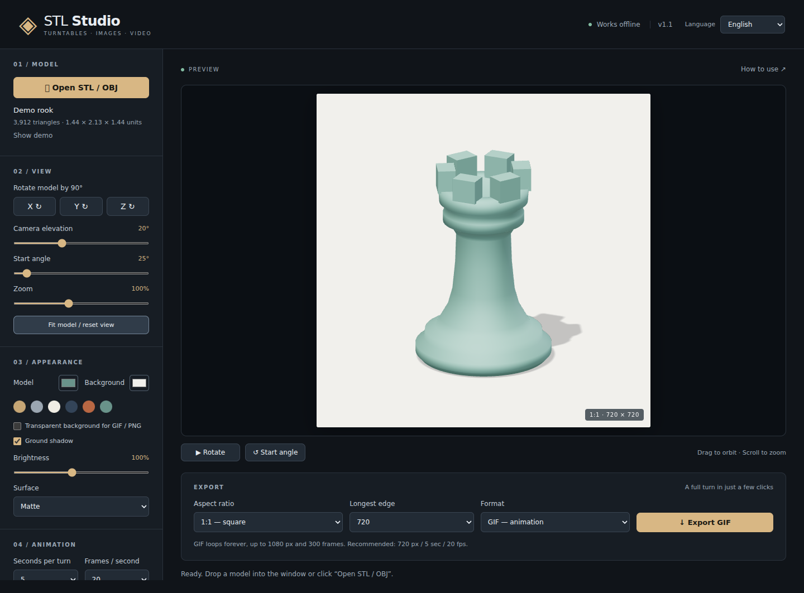

# STL Studio Offline

A local STL/OBJ turntable app for exporting GIF, MP4, WebM and PNG. No server, account or internet connection is needed to run the app. The interface is available in English and Russian.

**[Download the Windows bundle — v1.1](releases/STL_Studio_Offline_v1.1.zip?raw=1)** · [Русская инструкция](README.md)



## Quick start

1. Download and extract the entire ZIP into a folder.
2. Double-click `START.bat`. It opens the app in a separate window using an installed Microsoft Edge or Google Chrome.
3. Select **English** in the language selector at the top of the window.
4. Open your STL or OBJ, adjust the view, and click **Export**.

Alternatively, open `STL_Studio_Offline.html` directly in Edge or Chrome. Python, Node.js and FFmpeg are not needed to use the app. A modern browser with WebGL 2 support is required.

The selected language is remembered in this browser for this file when local storage is available. Switching languages preserves the loaded model, camera, settings and the last download link. The selector is temporarily disabled while loading a model or exporting. Other settings and the loaded model are not restored after closing the app.

## Features

- Binary and ASCII STL, plus OBJ geometry.
- One full turn with a configurable start angle, direction, duration and frame rate.
- 90° rotations around X, Y and Z; drag to orbit and scroll to zoom.
- Model and background colors, matte/satin/metal surfaces, brightness and ground shadows.
- Square, landscape and portrait output: 1:1, 16:9, 9:16 and 3:4.
- Frame-by-frame GIF, MP4 (H.264) and WebM (VP9/VP8) export, plus PNG snapshots.
- Transparent GIF/PNG backgrounds, export cancellation and a built-in demo rook.
- Translated controls, help, progress messages and errors.

Start with **720 px, 5 seconds, 20 fps, GIF**. For video, try **1080 px, 5 seconds, 30 fps, MP4**.

## Limits and behavior

| Setting | Limit or behavior |
|---|---|
| Input size | Up to 200 MB; speed depends on the model and computer |
| Longest edge | 480, 720, 1080, 1440 or 1920 px |
| GIF | Up to 1080 px and 300 frames; 256 colors and one-bit transparency |
| MP4 | Requires an available H.264 encoder; use WebM if unavailable |
| OBJ | Single-color geometry, without MTL files, external textures or animations |

PNG saves the current view. GIF and video begin at the selected start angle. GIF loops forever; videos contain one turn without audio, and playback looping depends on the player. Videos use the selected background color instead of transparency. Zooming beyond 100% may crop the model.

Geometry is not simplified or regenerated. The app displays the model surface without simulating FDM print layers. STL and OBJ often do not specify units, so dimensions are shown in file units. STL assumes Z-up; OBJ assumes Y-up. Use the X/Y/Z buttons if the model is lying on its side.

## Privacy

Models stay on your computer. All runtime libraries are embedded in the HTML file, and the app makes no network requests. Its content security policy also blocks network connections. Browser features outside the app are controlled by the browser itself.

## Build from source

Use Node.js 20 or newer:

```sh
npm ci
npm run build
```

Installing dependencies requires internet access. The resulting `dist/STL_Studio_Offline.html` works offline. Release ZIPs are separate snapshots; building does not replace them.

Source files are in `src/`; language catalogs are in `src/locales/ru.json` and `src/locales/en.json`. Keep catalog keys and named placeholders consistent when editing translations.

## Tests

```sh
npm install --no-save playwright
npx playwright install chromium
node tests/smoke.cjs
node tests/i18n.cjs
```

Tests run against a local file with networking disabled. Results go into `test-output/`. You can set `CHROMIUM_EXECUTABLE` for a custom browser and `PLAYWRIGHT_MODULE` for a custom Playwright installation. MP4 tests run when H.264 encoding is supported.

The language test checks translated controls and help, language persistence, model/view preservation, existing error and download text, restricted-storage fallback, narrow layouts and English exports.

## Third-party components

Three.js, gifenc, mp4-muxer and webm-muxer. License notices are included in [THIRD_PARTY_LICENSES.txt](dist/THIRD_PARTY_LICENSES.txt).
